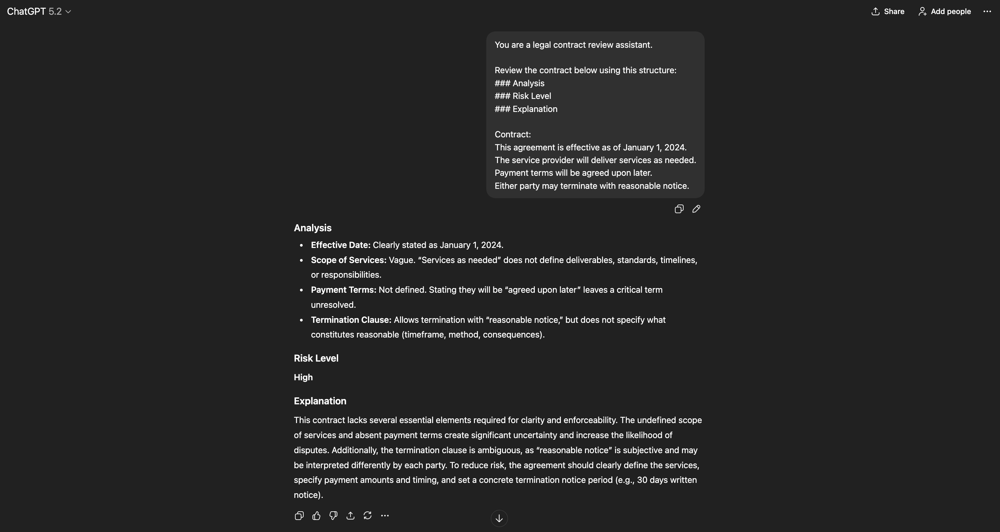
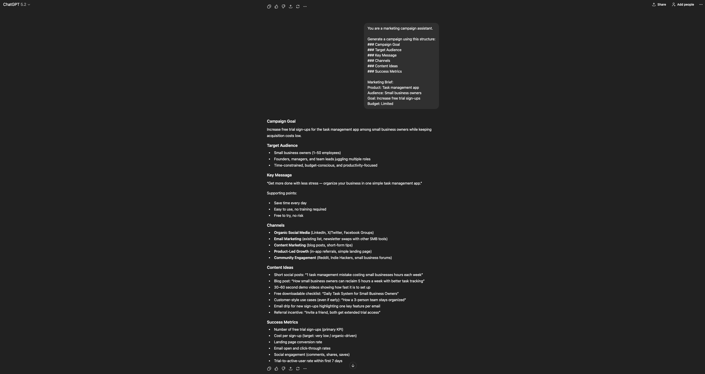
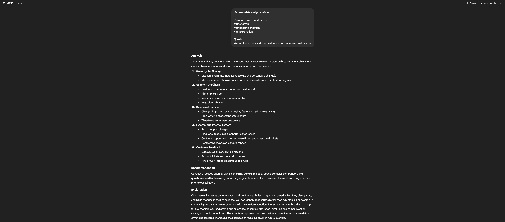

# Domain-Specific Assistant

## Overview
This project demonstrates how prompt engineering can be used
to create domain-specific assistants with clear role constraints
and safety guardrails.

The focus is on:
- Domain adaptation
- Structured outputs
- Responsible prompting
- Practical business use cases

## Assistants Included
- Legal Contract Reviewer
- Marketing Campaign Generator
- Data Analyst Assistant

## Examples

### Legal Contract Reviewer

### Marketing Campaign Generator

### Data Analyst Assistant

## Why This Matters
Domain-specific assistants must balance usefulness with safety.
This project shows how prompt design can guide models to provide
helpful insights without overstepping professional boundaries.
